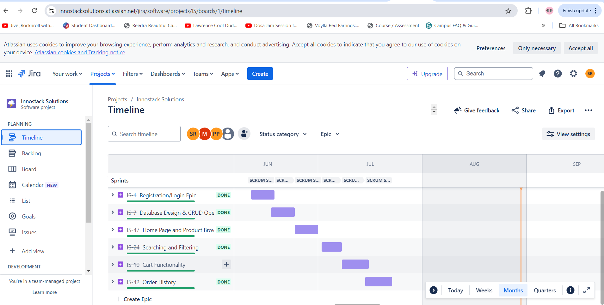
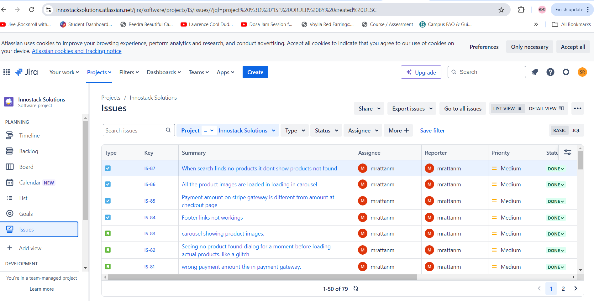
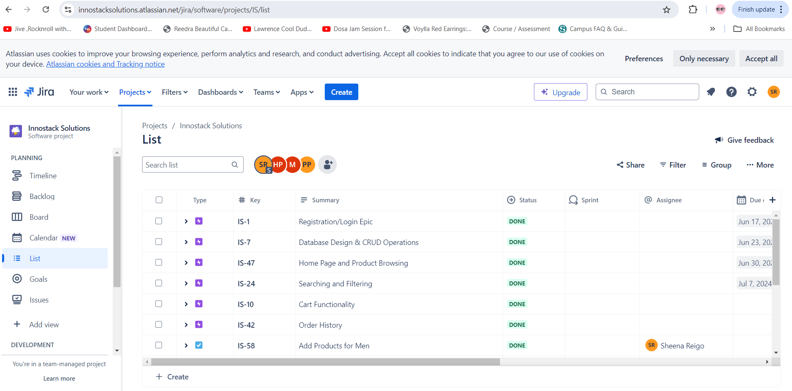

# Agile-Project-Management
This repository showcases my experience in Agile project management using Jira. It includes creating and managing user stories, sprint planning, task assignments, and progress tracking, with a focus on collaboration, continuous improvement, and successful project delivery.

## Project Goals

- **Efficient Project Planning**: Break down project requirements into actionable user stories and tasks.
- **Seamless Sprint Execution**: Manage the movement of tasks from backlog to sprints, ensuring smooth progress.
- **Effective Team Collaboration**: Assign tasks to team members and oversee the completion of work within set timelines.
- **Continuous Improvement**: Conduct weekly status meetings to assess progress, identify roadblocks, and drive improvements.

## My Role

Responsibilities of a project lead:

- **Creating and Managing User Stories and Epics**: 
  - Translated high-level project requirements into detailed user stories and epics.
  - Ensured all stories and epics were clear, actionable, and aligned with the project goals.

- **Sprint Planning and Task Assignment**: 
  - Led sprint planning sessions, moving user stories from the backlog into active sprints.
  - Assigned tasks and subtasks to team members, considering their expertise and availability.

- **Tracking Progress and Closing Tasks**: 
  - Monitored the progress of tasks and issues throughout the sprint.
  - Facilitated the closure of completed tasks, user stories, and epics at the end of each sprint cycle.

- **Conducting Weekly Status Meetings**: 
  - Organized and led weekly status calls to review project progress, address any blockers, and adjust plans as necessary.
  - Utilized insights from these meetings to optimize team performance and ensure alignment with project timelines.

## Tools and Technologies Used

- **Jira**: Central tool for project management, used to track user stories, tasks, and issues.
- **Agile Methodology**: Framework guiding the iterative development process.
- **Communication Platforms**: Microsoft Teams and emails for team communication and updates.

## Process Overview

### 1. **Creating User Stories, Epics, and Tasks**
   - **User Stories**: Captured specific, actionable requirements from the client's perspective.
   - **Epics**: Organized related user stories into larger categories to maintain a clear project structure.
   - **Tasks and Subtasks**: Detailed out the steps necessary to complete user stories, ensuring each task was manageable and well-defined.

### 2. **Sprint Planning**
   - Reviewed the backlog to prioritize user stories for the upcoming sprint.
   - Moved selected stories into the sprint and ensured each one had clear acceptance criteria.
   - Conducted planning sessions with the team to allocate tasks based on team capacity and expertise.

### 3. **Task Assignment**
   - Assigned tasks and subtasks to appropriate team members.
   - Maintained a balance in workload distribution to optimize team efficiency.
   - Ensured each team member understood their responsibilities and deadlines.

### 4. **Progress Tracking and Issue Resolution**
   - Used Jira dashboards to monitor the progress of sprints in real-time.
   - Actively managed issues as they arose, ensuring they were addressed promptly.
   - Facilitated the closure of completed tasks, ensuring they met the defined acceptance criteria.

### 5. **Weekly Status Meetings**
   - Held weekly status calls with the team to review sprint progress.
   - Discussed any blockers or challenges faced by the team and worked on solutions.
   - Adjusted sprint goals as needed to align with project timelines and objectives.

### 6. **Sprint Review and Retrospective**
   - At the end of each sprint, reviewed completed tasks and user stories with the team.
   - Conducted a retrospective to identify what went well and areas for improvement.
   - Used feedback to enhance the efficiency and effectiveness of subsequent sprints.

## Screenshots and Visuals

Here are some visuals that represent the project management process:

- **Jira Board Timeline**: 
  *This screenshot shows the Jira board timeline, including sprints and completed tasks.*

- **Issue Tracker**: 
  *This image captures the bugs and issues that are assigned to team members, their status and progress*

- **Requirements Translation to Epics/User Stories**: 
  *This screenshot illustrates the project requirements translated into epics*

## Lessons Learned

Throughout this project, I gained significant insights into the following areas:

- **Effective Backlog Management**: Prioritizing and organizing user stories to ensure the most critical tasks are addressed first.
- **Agile Execution**: Implementing Agile principles to create a flexible and adaptive project environment.
- **Team Collaboration**: Enhancing team dynamics through clear communication, task delegation, and regular feedback loops.
- **Continuous Improvement**: Using retrospectives and feedback to continually improve project outcomes and team performance.

## Conclusion

This repository serves as a comprehensive demonstration of my project management skills using Jira and Agile methodology. It showcases my ability to lead a project from concept to completion, ensuring that all objectives are met efficiently and effectively.

